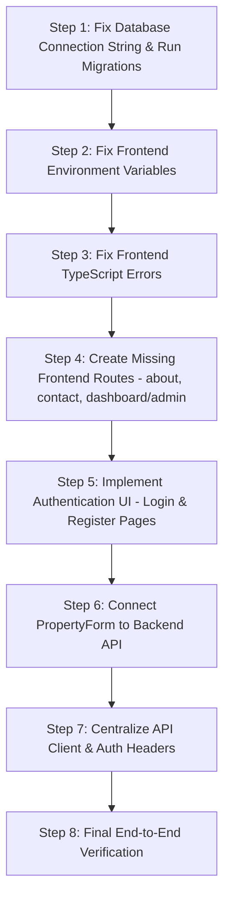

# Complete Project Audit & Technical Health Report (report1.md)
**Project**: DC Real Estate (Brokerage & Property Management Platform)  
**Date**: August 6, 2026  
**Status**: Comprehensive Technical Audit (No Code Modified)

---

## 1. Project Overview

**DC Real Estate** is a brokerage management and property advertising platform where brokers/agents manage and market property listings, customers browse listings and create inquiries/leads, and the platform owner (**Super Admin**) maintains complete control over operations, approvals, analytics, and user management.

### Tech Stack & Architecture:
* **Frontend**: Next.js 16.3.0 (App Router + Turbopack), React 19, Tailwind CSS v4, `@base-ui/react` 1.7.0, Shadcn UI components, Zustand (state management), TanStack React Query (data fetching), Axios, Lucide Icons.
* **Backend**: Node.js (v22), Express 5.2, TypeScript 5.4.5, Prisma ORM 6.16, Supabase PostgreSQL, Supabase Storage (media bucket), JWT Authentication, Zod validation, Helmet, CORS, Cookie Parser.

---

## 2. Implemented Features & Current Status

| Feature / Module | Scope | Current Status | Description / Assessment |
| :--- | :--- | :--- | :--- |
| **Public Homepage (`/`)** | Frontend | **Working (UI)** | Renders hero section, property category tabs, search bar, and static showcases cleanly. |
| **Public Property Catalog (`/properties`)** | Frontend & Backend | **Partial** | Fetches properties from `/api/public/properties`. UI renders, but filtering parameters and media mapping have edge cases. |
| **Property Details (`/properties/[slug]`)** | Frontend & Backend | **Partial** | Fetches single property by slug. Page works if backend is active and property slug matches. |
| **AI Property Search & Recs (`/api/ai/*`)** | Backend & Frontend Widget | **Partial** | AI controller logic implemented on backend; frontend widget `ai-chat-widget.tsx` sends queries directly to hardcoded backend endpoint. |
| **Broker Dashboard (`/dashboard/broker`)** | Frontend & Backend | **Partial / Broken** | Backend routes exist (`/api/broker/dashboard`, `/api/broker/properties`). Frontend page exists but suffers from TypeScript compilation errors (`asChild` on `<Button>`). |
| **Admin CRM (`/dashboard/admin/crm`)** | Frontend & Backend | **Partial** | Backend endpoints exist (`/api/crm/clients`, `/api/admin/*`). Frontend page renders `ClientTable`, but `Select` component event handler has type mismatch errors. |
| **Admin Operations (`/dashboard/admin/operations`)** | Frontend & Backend | **Partial** | Displays analytics and calendar components. Backend API implemented, but calendar view imports broken `date-fns` default export. |
| **Authentication Flow (API)** | Backend | **Working (Backend only)** | Controller & routes implemented for `/api/auth/register-broker`, `/api/auth/login`, `/api/auth/refresh`, `/api/auth/me`. |
| **Authentication Flow (UI)** | Frontend | **MISSING / BROKEN** | **No Login or Register page/modal exists** in the frontend. `useAuthStore` is never populated by any form. |
| **Property Listing Form (`/properties/new`)** | Frontend | **MOCK ONLY** | `PropertyForm.tsx` simulates submission via `setTimeout` and `alert()`. It does **not** call backend APIs to persist properties. |
| **Supabase Media Storage** | Frontend & Backend | **BROKEN (Config)** | `MediaUploader.tsx` relies on `frontend/.env` variables which use `VITE_` prefix instead of Next.js `NEXT_PUBLIC_` prefix, rendering Supabase URL empty string. |
| **Database Migrations / Connection** | Backend & Database | **CRITICAL BUG** | `backend/.env` PostgreSQL connection string password contains unencoded `@` and `#` symbols, breaking PostgreSQL pooler authentication. |
| **Static Navigation Links (`/about`, `/contact`)** | Frontend | **BROKEN (404)** | Links present in Navbar, but `app/about` and `app/contact` pages do not exist. |
| **Admin Dashboard Root (`/dashboard/admin`)** | Frontend | **BROKEN (404)** | Navbar links to `/dashboard/admin`, but `app/dashboard/admin/page.tsx` does not exist (only `/crm` and `/operations` subfolders). |

---

## 3. Missing or Incomplete Features

1. **Frontend User Authentication Pages / Modals**:
   * Missing `/login` or `/auth/login` page.
   * Missing `/register` or `/auth/register` page for broker onboarding.
   * Missing Auth Modal / Header Login button trigger.
2. **Missing Frontend Routes (404 Errors)**:
   * Missing `app/about/page.tsx` (`/about`).
   * Missing `app/contact/page.tsx` (`/contact`).
   * Missing `app/dashboard/admin/page.tsx` (`/dashboard/admin`).
   * Missing `app/dashboard/page.tsx` (`/dashboard` route redirector/overview).
3. **Property Creation API Integration**:
   * `PropertyForm.tsx` is completely mocked with `setTimeout`. Needs integration with `POST /api/broker/properties` or `POST /api/public/properties`.
4. **Lead & Inquiry Creation Flow**:
   * Customer property inquiry form / "Schedule Visit" modal on property pages is not connected to create `Lead` records in the database.
5. **Unified Axios API Client with Auth Interceptors**:
   * Components make scattered `axios.get('http://localhost:5000/api/...')` calls without attaching JWT `Authorization: Bearer <token>` headers or automatically attempting refresh tokens on 401 errors.

---

## 4. Route and API Analysis

### Backend Routes Map (`backend/src/routes/*.ts`):
* `/api/auth`: `POST /register-broker`, `POST /login`, `POST /refresh`, `POST /logout`, `GET /me`
* `/api/public`: `GET /properties`, `GET /properties/:slug`
* `/api/broker`: `GET /dashboard`, `GET /properties`
* `/api/admin`: `GET /dashboard`, `GET /broker-requests`, `POST /approve-broker`
* `/api/crm`: `GET /clients`, `GET /clients/:id`, `PATCH /clients/:id/stage`
* `/api/analytics`: `GET /dashboard`
* `/api/calendar`: `GET /`
* `/api/ai`: `POST /search`, `GET /recommendations/:clientId`
* `/api/payment`: `POST /create-order`, `POST /verify`

### Frontend App Directory Structure (`frontend/src/app`):
```
app/
├── page.tsx                           -> / (Homepage)
├── blog/
│   └── page.tsx                       -> /blog (Blog list)
├── properties/
│   ├── page.tsx                       -> /properties (Properties catalog)
│   ├── [slug]/
│   │   └── page.tsx                   -> /properties/[slug] (Property details)
│   └── new/
│       └── page.tsx                   -> /properties/new (Create listing - MOCKED)
└── dashboard/
    ├── broker/
    │   └── page.tsx                   -> /dashboard/broker (Broker Dashboard - TS Error)
    └── admin/
        ├── crm/
        │   └── page.tsx               -> /dashboard/admin/crm (CRM view)
        └── operations/
            └── page.tsx               -> /dashboard/admin/operations (Operations view)
```

---

## 5. Authentication Flow Analysis

### Backend Implementation:
* **Password Hashing**: `bcryptjs` for secure password hashing.
* **Token Strategy**: Dual JWT token pattern (`generateAccessToken` 15m, `generateRefreshToken` 7d).
* **Middleware**: `requireAuth` extracts `Bearer <token>` from `Authorization` header, verifies JWT, and attaches `req.user = { userId, role }`.

### Frontend Implementation & Defect:
* **State Store**: `useAuthStore.ts` (Zustand + `persist` middleware) defines `user`, `accessToken`, `setAuth`, `logout`.
* **The Critical Flaw**: `setAuth()` is **never invoked anywhere in the codebase**. There are zero login forms, zero registration forms, and zero API auth handlers on the client. 
* **Protected Navigation**: Navbar checks `isAuthenticated` and `user.role`, but because `user` is always `null`, role-based navigation buttons ("Admin Dashboard", "Broker Dashboard") remain hidden to users.

---

## 6. Prisma & Database Health Audit

### Database Connection String Defect (CRITICAL):
In `backend/.env`:
```env
DATABASE_URL="postgresql://postgres.zilxzfjkuzucaxplkdec:Quickie@#@#2026@aws-0-ap-southeast-1.pooler.supabase.com:6543/postgres?pgbouncer=true"
DIRECT_URL="postgresql://postgres.zilxzfjkuzucaxplkdec:Quickie@#@#2026@aws-0-ap-southeast-1.pooler.supabase.com:5432/postgres"
```
* **Issue**: Password contains unencoded special characters `@` and `#` (`Quickie@#@#2026`). In URI standard syntax, `@` delimits user credentials from the host name. This causes URI parsing libraries to parse the host incorrectly, triggering PostgreSQL error `P1000: Authentication failed against database server`.
* **Fix Required**: Special characters in connection string passwords must be URL-encoded:
  * `@` -> `%40`
  * `#` -> `%23`
  * Resulting password string: `Quickie%40%23%40%232026`

### Schema Architecture (`backend/prisma/schema.prisma`):
* Models are well-structured: `User`, `BrokerRequest`, `Property`, `PropertyMedia`, `Amenity`, `PropertyDocument`, `Client`, `Lead`, `ClientRequirement`, `ClientActivity`, `FollowUp`, `SiteVisit`, `Invoice`, `AuditLog`.
* **Role Enums**: `SUPER_ADMIN`, `BROKER`, `CUSTOMER`.
* **Property Status Enums**: `DRAFT`, `PENDING`, `PUBLISHED`, `UNLISTED`, `ARCHIVED`.
* Soft delete pattern implemented with `deletedAt DateTime?`.

---

## 7. Dependency & Environment Variable Audit

### Environment Variables Disconnect:

#### 1. Frontend Environment File (`frontend/.env`):
Current content:
```env
VITE_API_URL=http://localhost:5000/api
VITE_SUPABASE_URL=https://zilxzfjkuzucaxplkdec.supabase.co
VITE_SUPABASE_ANON_KEY="eyJhbGci..."
```
* **Defect**: Variables use Vite's `VITE_` prefix. Next.js App Router **only** bundles environment variables prefixed with `NEXT_PUBLIC_` into browser JavaScript.
* **Impact**: `process.env.NEXT_PUBLIC_SUPABASE_URL` in `frontend/src/lib/supabase.ts` evaluates to `""` (empty string), completely breaking Supabase storage initialization and file uploads!
* **Required Fix**: Rename keys in `frontend/.env`:
  * `NEXT_PUBLIC_API_URL=http://localhost:5000/api`
  * `NEXT_PUBLIC_SUPABASE_URL=https://zilxzfjkuzucaxplkdec.supabase.co`
  * `NEXT_PUBLIC_SUPABASE_ANON_KEY=eyJhbGci...`

#### 2. Backend Environment File (`backend/.env`):
Contains `PORT`, `NODE_ENV`, `DATABASE_URL`, `DIRECT_URL`, `JWT_ACCESS_SECRET`, `JWT_REFRESH_SECRET`, `FRONTEND_URL`, `SUPABASE_URL`, `SUPABASE_ANON_KEY`, `SUPABASE_SERVICE_ROLE_KEY`. Must URL-encode DB password as noted above.

---

## 8. TypeScript & Compilation Health

### Backend Compilation Status:
* **Status**: **CLEAN (0 Errors)**.
* Tested with `npx tsc --noEmit` on `backend`. All controller, middleware, and schema type errors have been fully resolved.

### Frontend Compilation Status:
* **Status**: **4 Compilation Errors** found when running `npx tsc --noEmit` on `frontend`:

1. `src/app/dashboard/broker/page.tsx:24`:
   * **Error**: `Property 'asChild' does not exist on type 'ButtonProps'`
   * **Cause**: Custom `@base-ui/react` `Button` component does not support Radix `asChild` prop. `<Button asChild><Link .../></Button>` must be updated to `<Link ...><Button .../></Link>`.
2. `src/components/crm/client-table.tsx:43`:
   * **Error**: Type mismatch passing `Dispatch<SetStateAction<string>>` to Base UI `Select` `onChange` handler.
3. `src/components/operations/analytics-dashboard.tsx:83`:
   * **Error**: `TS18048: 'percent' is possibly 'undefined'`.
4. `src/components/operations/calendar-view.tsx:5`:
   * **Error**: `Module 'date-fns/locale/en-US' has no default export`. Must use named import `import { enUS } from 'date-fns/locale/en-US'`.

---

## 9. Frontend-Backend Integration Audit

1. **Scattered Direct Hardcoded URLs**:
   * Components make direct `axios.get('http://localhost:5000/api/...')` calls instead of using a central configured API instance (`@/lib/api/crm.ts`).
2. **Missing Request Authentication**:
   * Calls to protected endpoints (`/api/calendar`, `/api/analytics/dashboard`, `/api/broker/*`) do not attach `Authorization: Bearer <token>` headers or session cookies.
3. **Data Model Mismatches**:
   * Public property listing pages expect image objects under `p.images`, whereas backend returns unified `p.media` array (or mapped `p.images` / `p.videos`).

---

## 10. Primary Reasons Why the Website is Currently Not Functioning End-to-End

1. **Database Unreachable**: DB connection fails due to unencoded special characters in connection URL password (`Quickie@#@#2026`).
2. **Supabase File Uploads Broken**: `frontend/.env` uses `VITE_` instead of `NEXT_PUBLIC_`, causing `createClient('', '')` in `supabase.ts`.
3. **No Auth Interface**: Users cannot log in or register because frontend has no Auth pages or forms.
4. **Mocked Form Submissions**: Creating listings at `/properties/new` only triggers a javascript `alert()` and never saves to database.
5. **Broken Navbar & Dashboard Links**: Navigating to `/about`, `/contact`, or `/dashboard/admin` hits 404 pages.
6. **Frontend TypeScript Compilation Failures**: 4 frontend TS errors prevent clean production builds (`next build`).

---

## 11. Production Readiness Assessment

* **Current Rating**: **1.5 / 5.0 (Experimental / Early Integration)**
* **Verdict**: **NOT Production Ready**. 
* **Key Strengths**: Excellent UI aesthetic design tokens, well-structured database schema, solid backend controller architecture, and clean backend TypeScript build.
* **Key Weaknesses**: Missing auth UI, unencoded DB credentials, broken environment variable naming, non-functional frontend form submissions, and missing core Next.js page routes.

---

## 12. Prioritized Step-by-Step Action Plan

To make the application 100% operational, the following sequential fix plan should be executed:



### Step 1: Fix Database Connection String & Run Migrations (Priority: CRITICAL)
* In `backend/.env`, URL-encode special characters in `DATABASE_URL` and `DIRECT_URL`:
  * Replace `Quickie@#@#2026` with `Quickie%40%23%40%232026`.
* Run `npx prisma db push` or `npx prisma migrate dev` in `backend` to push schema to Supabase Postgres.

### Step 2: Fix Frontend Environment Variables (Priority: HIGH)
* Update `frontend/.env`:
  * Rename `VITE_API_URL` -> `NEXT_PUBLIC_API_URL`
  * Rename `VITE_SUPABASE_URL` -> `NEXT_PUBLIC_SUPABASE_URL`
  * Rename `VITE_SUPABASE_ANON_KEY` -> `NEXT_PUBLIC_SUPABASE_ANON_KEY`

### Step 3: Resolve Frontend TypeScript Errors (Priority: HIGH)
* `src/app/dashboard/broker/page.tsx`: Replace `<Button asChild><Link .../></Button>` with `<Link ...><Button .../></Link>`.
* `src/components/crm/client-table.tsx`: Fix Base UI `Select` type handler.
* `src/components/operations/analytics-dashboard.tsx`: Add fallback null check for `percent`.
* `src/components/operations/calendar-view.tsx`: Fix `date-fns` locale import (`import { enUS } from 'date-fns/locale/en-US'`).

### Step 4: Create Missing Routes & Fix 404s (Priority: MEDIUM)
* Create `frontend/src/app/about/page.tsx` for company background & overview.
* Create `frontend/src/app/contact/page.tsx` for inquiry/contact page.
* Create `frontend/src/app/dashboard/admin/page.tsx` as the main Admin Dashboard overview landing page.

### Step 5: Implement Frontend Authentication UI (Priority: HIGH)
* Create `frontend/src/app/login/page.tsx` and `frontend/src/app/register/page.tsx` (or auth modal).
* Wire form submission to call backend `POST /api/auth/login` and `POST /api/auth/register-broker`.
* Call `useAuthStore.getState().setAuth(user, token)` on success to update global auth state.

### Step 6: Connect Property Creation Form to Backend API (Priority: HIGH)
* Update `frontend/src/components/crm/PropertyForm.tsx` to replace mock `setTimeout` with `axios.post('/api/broker/properties', propertyData)`.

### Step 7: Centralize API Client & Auth Header Attachment (Priority: MEDIUM)
* Update `frontend/src/lib/api/crm.ts` (or central `api.ts`) to add request interceptor that attaches `Authorization: Bearer ${useAuthStore.getState().accessToken}` to all requests.
* Replace direct `http://localhost:5000` URLs across components with `api` instance.

### Step 8: End-to-End Verification (Priority: MEDIUM)
* Run `npm run build` on `frontend` and `backend`.
* Verify user login flow, property listing creation, media upload to Supabase, and role-based dashboard access end-to-end.
